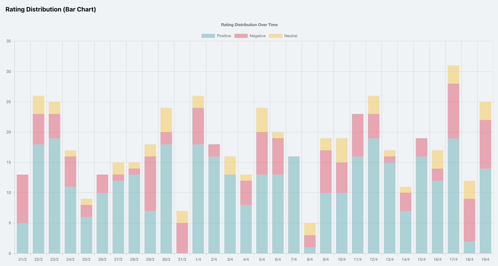

# Rating Distribution Bar Chart Documentation

## Overview

The Rating Distribution Bar Chart is a key component of the rating dashboard that visualizes the distribution of ratings over time. It provides a stacked bar chart representation where each bar represents a specific time period (e.g., day, week) and shows the distribution of positive, neutral, and negative ratings within that period.



## Libraries and Dependencies

The chart is built using the following libraries:

1. **React** - For component-based UI development
2. **Chart.js** - The core charting library
3. **react-chartjs-2** - React wrapper for Chart.js

### Specific Chart.js Components Used

```javascript
import {
    Chart as ChartJS,
    CategoryScale,
    LinearScale,
    BarElement,
    Title,
    Tooltip,
    Legend,
} from 'chart.js';

ChartJS.register(
    CategoryScale,
    LinearScale,
    BarElement,
    Title,
    Tooltip,
    Legend
);
```

- **CategoryScale** - For the x-axis categories (dates)
- **LinearScale** - For the y-axis numeric values
- **BarElement** - For rendering the bar segments
- **Title** - For chart title
- **Tooltip** - For interactive tooltips
- **Legend** - For displaying the data type legend

## Component Implementation

The component is implemented as a functional React component:

```typescript
import React from 'react';
import { Bar } from 'react-chartjs-2';
// Import Chart.js components as shown above

interface ChartData {
    labels: string[];
    datasets: {
        label: string;
        data: number[];
        backgroundColor: string;
    }[];
}

interface RatingBarChartProps {
    data: ChartData;
}

const RatingBarChart: React.FC<RatingBarChartProps> = ({ data }) => {
    const options = {
        responsive: true,
        plugins: {
            legend: {
                position: 'top' as const,
            },
            title: {
                display: true,
                text: 'Rating Distribution Over Time',
            },
        },
        scales: {
            x: {
                stacked: true,
            },
            y: {
                stacked: true,
            },
        },
    };

    return <Bar data={data} options={options} />;
};

export default RatingBarChart;
```

## Configuration and Styling

### Chart Options

The chart is configured with the following options:

1. **Responsive** - The chart adjusts to the container size
2. **Stacked Scales** - Both x and y axes are stacked to create proper stacked bars
3. **Legend** - Positioned at the top of the chart
4. **Title** - Displays "Rating Distribution Over Time"

```javascript
const options = {
    responsive: true,
    plugins: {
        legend: {
            position: 'top' as const,
        },
        title: {
            display: true,
            text: 'Rating Distribution Over Time',
        },
    },
    scales: {
        x: {
            stacked: true,
        },
        y: {
            stacked: true,
        },
    },
};
```

### Visual Styling

The chart's visual styling is primarily controlled through the data object passed to the component, particularly through the `backgroundColor` property of each dataset. Typical color schemes are:

- **Positive ratings**: `'rgb(75, 192, 192)'` or `'#4caf50'` (green)
- **Neutral ratings**: `'rgb(201, 203, 207)'` or `'#9e9e9e'` (gray)
- **Negative ratings**: `'rgb(255, 99, 132)'` or `'#f44336'` (red)

## Data Structure

The chart expects data in the following structure:

```typescript
interface ChartData {
    labels: string[];     // X-axis labels (dates or time periods)
    datasets: {
        label: string;    // Dataset name (e.g., "Positive", "Neutral", "Negative")
        data: number[];   // Values for each label (must match labels array length)
        backgroundColor: string;  // Color for this dataset's bars
    }[];
}
```

### Example Data Object

```javascript
const chartData = {
    labels: ['01/04/2025', '02/04/2025', '03/04/2025', '04/04/2025', '05/04/2025'],
    datasets: [
        {
            label: 'Positive',
            data: [12, 19, 8, 15, 10],
            backgroundColor: 'rgb(75, 192, 192)',
        },
        {
            label: 'Neutral',
            data: [5, 7, 4, 9, 6],
            backgroundColor: 'rgb(201, 203, 207)',
        },
        {
            label: 'Negative',
            data: [3, 2, 5, 1, 4],
            backgroundColor: 'rgb(255, 99, 132)',
        },
    ],
};
```

## Data Preparation

To prepare data for the chart from raw ratings data, a transformation process is typically used:

1. Group ratings by date/time period
2. For each group, count the number of positive, neutral, and negative ratings
3. Format the counts into the required chart data structure

Example data preparation function:

```typescript
function prepareChartData(ratings) {
    // Group ratings by date
    const groupedByDate = {};
    
    ratings.forEach(rating => {
        const date = rating.date;
        if (!groupedByDate[date]) {
            groupedByDate[date] = { positive: 0, neutral: 0, negative: 0 };
        }
        
        // Categorize rating
        if (rating.score > 3) {
            groupedByDate[date].positive += 1;
        } else if (rating.score < -3) {
            groupedByDate[date].negative += 1;
        } else {
            groupedByDate[date].neutral += 1;
        }
    });
    
    // Convert to chart data format
    const chartData = {
        labels: Object.keys(groupedByDate).sort(),
        datasets: [
            {
                label: 'Positive',
                data: [],
                backgroundColor: 'rgb(75, 192, 192)',
            },
            {
                label: 'Neutral',
                data: [],
                backgroundColor: 'rgb(201, 203, 207)',
            },
            {
                label: 'Negative',
                data: [],
                backgroundColor: 'rgb(255, 99, 132)',
            },
        ],
    };
    
    // Fill dataset values
    chartData.labels.forEach(date => {
        chartData.datasets[0].data.push(groupedByDate[date].positive);
        chartData.datasets[1].data.push(groupedByDate[date].neutral);
        chartData.datasets[2].data.push(groupedByDate[date].negative);
    });
    
    return chartData;
}
```

## Usage in Dashboard

The RatingBarChart component is used in the Dashboard component as follows:

```jsx
<div className="bar-chart-placeholder">
    <RatingBarChart data={dashboardData.ratingDistribution} />
</div>
```

Where `dashboardData.ratingDistribution` contains the properly formatted chart data structure.

## Customization Options

The chart can be customized in several ways:

1. **Colors** - Change the `backgroundColor` for each dataset
2. **Chart Title** - Modify the `options.plugins.title.text` property
3. **Legend Position** - Adjust the `options.plugins.legend.position` property
4. **Axis Labels** - Add custom axis labels through the scales configuration
5. **Tooltip Formatting** - Customize tooltips through Chart.js tooltip callbacks

## Responsive Behavior

The chart is configured to be responsive, which means it will automatically resize to fit its container. This behavior can be fine-tuned using CSS for the chart container and through Chart.js responsive options.

## Accessibility Considerations

To improve accessibility, consider:

1. Adding ARIA labels to the chart container
2. Using color schemes with sufficient contrast
3. Providing alternative text or tabular data representation

## Performance Optimization

For large datasets, consider:

1. Limiting the number of data points displayed
2. Aggregating data by longer time periods
3. Implementing lazy loading or pagination for historical data