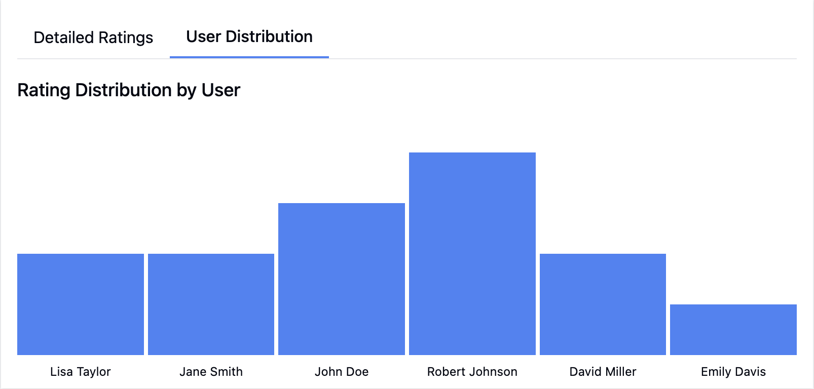

# Detailed Ratings and User Distribution Tabs Implementation

This document provides a comprehensive overview of the implementation details for the Detailed Ratings and User Distribution tabs in the Chatbot Ratings Dashboard, including libraries, controls, styles, visual adjustments, data connections, and data models.

## Overview

When a user selects a rating category tile in the summary area, a detailed view appears with two tabs:

1. **Detailed Ratings Tab**: Displays individual ratings that match the selected category, showing the rating value, user, date, and message content

2. **User Distribution Tab**: Shows a bar chart representing the distribution of ratings in the selected category across different users


## Libraries and Components

### Core Libraries
- **React**: Functional components with hooks for the tabs and their content
- **Tailwind CSS**: Utility classes for styling all elements
- **Lucide React**: Icon components (not directly used in the tabs but available)

### Custom Components
1. **Tab Navigation**: Custom tab implementation for switching between views
2. **Rating Item**: Component for displaying individual rating details
3. **RatingDistributionChart**: Bar chart component for visualizing user distribution

## Tab Navigation Implementation

### Visual Styling

#### Layout and Dimensions
- **Container**: 
  - Flex layout: `flex border-b`
  - Bottom border to separate tabs from content
- **Tab Buttons**:
  - Padding: `px-4 py-2` (horizontal: 1rem, vertical: 0.5rem)
  - Active indicator: `border-b-2 border-blue-500 font-medium`
  - Width: Auto-sized to content

#### Typography
- **Normal tab**: Default text size and weight
- **Active tab**: `font-medium` for subtle emphasis

#### Code Implementation
```jsx
<div className="flex border-b">
  <button
    className={`px-4 py-2 ${activeTab === 'details' ? 'border-b-2 border-blue-500 font-medium' : ''}`}
    onClick={() => setActiveTab('details')}
  >
    Detailed Ratings
  </button>
  <button
    className={`px-4 py-2 ${activeTab === 'distribution' ? 'border-b-2 border-blue-500 font-medium' : ''}`}
    onClick={() => setActiveTab('distribution')}
  >
    User Distribution
  </button>
</div>
```

### Tab State Management
```javascript
const [activeTab, setActiveTab] = useState('details');
```

## Detailed Ratings Tab

### Visual Styling

#### Container Layout
- **Spacing**: `space-y-4` (1rem vertical gap between items)
- **Empty state**: Centered gray text when no ratings are found
- **Overflow handling**: `overflow-visible h-auto` to ensure all content is visible

#### Rating Item Styling
- **Container**: 
  - Border: `border rounded p-3` (thin border, rounded corners, padding of 0.75rem)
  - Margin: Part of parent's `space-y-4`
- **Header Row**:
  - Layout: `flex justify-between mb-2` (spread content with margin below)
  - Rating value: `font-medium` (slightly bolder)
  - Metadata: `text-gray-500 text-sm` (smaller gray text)
- **Message Content**:
  - Default styling
  - "Show more"/"Show less" button: `text-blue-500 text-sm mt-1` (blue, smaller text with margin above)

#### Code Implementation
```jsx
<div className="space-y-4">
  {categoryDetails.length > 0 ? (
    categoryDetails.map(rating => (
      <div key={rating.id} className="border rounded p-3">
        <div className="flex justify-between mb-2">
          <span className="font-medium">
            Rating: {rating.rating > 0 ? `+${rating.rating}` : rating.rating}
          </span>
          <span className="text-gray-500 text-sm">
            {rating.date} - {mockUsers.find(u => u.id === rating.userId)?.name}
          </span>
        </div>
        <div>
          <p>
            {expandedMessages[rating.id] 
              ? rating.message 
              : `${rating.message.substring(0, 100)}${rating.message.length > 100 ? '...' : ''}`}
          </p>
          {rating.message.length > 100 && (
            <button
              className="text-blue-500 text-sm mt-1"
              onClick={() => toggleMessageExpansion(rating.id)}
            >
              {expandedMessages[rating.id] ? 'Show less' : 'Show more'}
            </button>
          )}
        </div>
      </div>
    ))
  ) : (
    <p className="text-center text-gray-500">No ratings found for this category.</p>
  )}
</div>
```

### Message Expansion Logic
```javascript
const [expandedMessages, setExpandedMessages] = useState({});

// Toggle message expansion
const toggleMessageExpansion = (messageId) => {
  setExpandedMessages({
    ...expandedMessages,
    [messageId]: !expandedMessages[messageId]
  });
};
```

## User Distribution Tab

### Visual Styling

#### Container Layout
- **Title**: `text-lg font-medium mb-4` (slightly larger text with bottom margin)
- **Chart container**: Full width with auto height

#### Bar Chart Styling
- **Container**: 
  - Height: `h-64` (16rem/256px fixed height)
  - Spacing: `space-x-1 pt-4` (small horizontal gaps, top padding)
  - Overflow: `overflow-x-auto pb-8` (horizontal scrolling with bottom padding for labels)
- **Individual bars**:
  - Width: Calculated based on number of items, with minimum width
  - Background: `bg-blue-500` (medium blue)
- **Labels**:
  - Position: Below each bar
  - Styling: `text-xs mt-2 transform -rotate-45 origin-top-left truncate w-24` (small text, rotated for better fit)

#### Code Implementation
```jsx
const RatingDistributionChart = ({ data }) => {
  const maxValue = Math.max(...Object.values(data));
  
  return (
    <div className="w-full h-64 flex items-end space-x-1 pt-4">
      {Object.entries(data).map(([user, count], index) => (
        <div key={index} className="flex flex-col items-center" style={{ width: `${100 / (Object.keys(data).length * 1.5)}%`, minWidth: '20px' }}>
          <div 
            className="w-full bg-blue-500" 
            style={{ height: `${(count / maxValue) * 200}px` }}
          ></div>
          <div className="text-xs mt-2 transform -rotate-45 origin-top-left truncate w-24">{user}</div>
        </div>
      ))}
    </div>
  );
};
```

## Data Models and Connections

### Rating Data Model
```typescript
interface Rating {
  id: number;
  userId: number;
  date: string;     // Format: 'dd/mm/yyyy'
  rating: number;   // Range: -10 to 10
  message: string;  // User feedback message
}
```

### User Model
```typescript
interface User {
  id: number;
  name: string;
}
```

### Detailed Ratings Data Connection

The Detailed Ratings tab connects to the data through a filtering function that returns ratings matching the selected category:

```javascript
// Get rating details for selected category
const getCategoryDetails = () => {
  if (!selectedCategory) return [];
  
  const filteredRatings = getFilteredRatings();
  
  switch(selectedCategory) {
    case 'positive':
      return filteredRatings.filter(r => r.rating > 0 && r.rating <= 6);
    case 'negative':
      return filteredRatings.filter(r => r.rating < 0 && r.rating >= -6);
    case 'neutral':
      return filteredRatings.filter(r => r.rating >= -3 && r.rating <= 3);
    case 'heavilyPositive':
      return filteredRatings.filter(r => r.rating > 6);
    case 'heavilyNegative':
      return filteredRatings.filter(r => r.rating < -6);
    default:
      return [];
  }
};
```

### User Distribution Data Connection

The User Distribution tab connects to the data through a transformation function that counts ratings by user:

```javascript
// Get distribution data for user chart
const getUserDistributionData = () => {
  const categoryRatings = getCategoryDetails();
  const distribution = {};
  
  categoryRatings.forEach(rating => {
    const user = mockUsers.find(u => u.id === rating.userId)?.name || `User ${rating.userId}`;
    if (!distribution[user]) {
      distribution[user] = 0;
    }
    distribution[user] += 1;
  });
  
  return distribution;
};
```

This returns an object where:
- Keys are user names
- Values are the count of ratings from that user in the selected category

### Data Flow

1. User selects a rating category tile
2. `selectedCategory` state is updated
3. `getCategoryDetails()` filters ratings for the selected category
4. If the "Detailed Ratings" tab is active, those ratings are displayed
5. If the "User Distribution" tab is active, `getUserDistributionData()` transforms the ratings data
6. The transformed data is passed to the `RatingDistributionChart` component

## Detailed Interaction Flow

### When Selecting a Category
```javascript
// In the Rating Summary Area
<button
  key={category}
  className={`p-4 rounded-lg shadow min-w-32 text-center cursor-pointer transition-all ${
    selectedCategory === category 
      ? 'bg-blue-600 text-white' 
      : 'bg-white hover:bg-blue-50'
  }`}
  onClick={() => setSelectedCategory(category)}
>
  {/* Content */}
</button>
```

### When Switching Tabs
```javascript
// Tab buttons
<button
  className={`px-4 py-2 ${activeTab === 'details' ? 'border-b-2 border-blue-500 font-medium' : ''}`}
  onClick={() => setActiveTab('details')}
>
  Detailed Ratings
</button>

// Tab content conditional rendering
{activeTab === 'details' ? (
  <div className="space-y-4">
    {/* Detailed ratings content */}
  </div>
) : (
  <div>
    <h3 className="text-lg font-medium mb-4">Rating Distribution by User</h3>
    <RatingDistributionChart data={userDistribution} />
  </div>
)}
```

### When Expanding Messages
```javascript
{rating.message.length > 100 && (
  <button
    className="text-blue-500 text-sm mt-1"
    onClick={() => toggleMessageExpansion(rating.id)}
  >
    {expandedMessages[rating.id] ? 'Show less' : 'Show more'}
  </button>
)}
```

## Bar Chart Implementation Details

The bar charts used in both the main dashboard and the User Distribution tab share a similar implementation approach:

1. Calculate the maximum value to scale bars properly
2. Render a container with flex layout and items aligned to the bottom
3. Create dynamic bar heights using percentage-based calculations
4. Use custom width calculations to fit all bars:
   ```javascript
   style={{ width: `${100 / (Object.keys(data).length * 1.5)}%`, minWidth: '20px' }}
   ```
5. Scale bar heights proportionally to the maximum value:
   ```javascript
   style={{ height: `${(count / maxValue) * 200}px` }}
   ```

## Implementation Considerations

### Scalability
- The design accommodates varying numbers of ratings
- Scrollable containers prevent overflow with large datasets
- Dynamic sizing ensures appropriate display regardless of data size

### Performance Optimizations
- Calculated data is stored in variables to prevent recalculation on render
- Message expansion state uses a map for efficient lookups
- Component re-renders only when necessary state changes

### Accessibility
- Tab controls follow standard button semantics
- Color contrasts meet WCAG standards
- Text sizes are appropriate for readability
- Interactive elements have clear visual indicators

### Responsiveness
- Horizontal scrolling is enabled for charts and content that might overflow
- Text truncation is applied to prevent layout issues
- Rotated labels help fit more data in limited space

## Integration Requirements

To integrate these tabs with a real data source, you would need:

1. **API Endpoints**:
   - `/ratings` with filtering parameters for category, date range, users
   - `/users` to fetch user information

2. **Data Processing**:
   - Server-side filtering for better performance with large datasets
   - Pagination for detailed ratings (when many ratings exist)
   - Data transformation functions for user distribution data

3. **Enhanced Functionality**:
   - Sorting options for detailed ratings (by date, rating value, etc.)
   - Filtering within the detailed view
   - Expanded user details on hover/click in the distribution chart

4. **State Management**:
   - Consider moving to Redux or Context API for large applications
   - Implement caching for previously fetched data

## Design Decisions

### Tab-Based Interface
- **Rationale**: Separates individual details from aggregated data without cluttering the UI
- **Benefit**: Users can focus on one type of analysis at a time

### Message Truncation
- **Rationale**: Keeps the interface clean while providing access to full content
- **Benefit**: Users can scan multiple ratings quickly or dive deeper as needed

### Bar Chart for User Distribution
- **Rationale**: Visual representation is more intuitive than numeric data
- **Benefit**: Patterns and outliers can be quickly identified

### Rotated Labels
- **Rationale**: Accommodates longer user names without excessive horizontal space
- **Benefit**: More data points can be displayed in the same space

### Fixed Height Charts
- **Rationale**: Provides consistent visual presentation
- **Benefit**: Prevents layout shifts as data changes

## Potential Enhancements

1. **Advanced Filtering**: Add filtering options within the detailed view
2. **Sorting Controls**: Allow users to sort detailed ratings by different criteria
3. **Pagination**: Implement pagination for detailed ratings with large datasets
4. **Data Export**: Add options to export data in CSV or other formats
5. **Interactive Charts**: Enhance charts with tooltips, click interactions, and animations
6. **Message Threading**: Show conversation context when expanding messages
7. **Advanced Visualization**: Add trend lines or other statistical overlays to charts