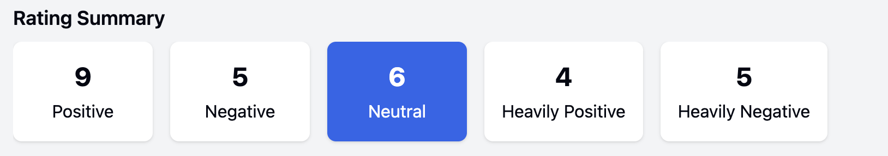

# Chatbot Dashboard Rating Summary Implementation

This document provides a comprehensive overview of the rating summary area implementation in the Chatbot Ratings Dashboard, detailing the libraries, components, styles, and data connections used.

## Overview

The rating summary area consists of:
1. A horizontal row of tiles displaying rating category counts
2. Each tile is selectable and shows a different rating category
3. When a tile is selected, it displays detailed information below
4. Only categories with data are shown as tiles



## Libraries and Components

### Core Libraries
- **React**: The rating summary is built using React functional components with hooks
- **Tailwind CSS**: Provides utility classes for all styling

### Key Components
1. **Summary Tile Container**: Horizontal scrollable container for rating category tiles
2. **Category Tiles**: Interactive cards showing rating category counts
3. **Selected Category Detail View**: 
   - Tab navigation between "Detailed Ratings" and "User Distribution"
   - Detailed ratings list showing individual ratings
   - User distribution chart showing rating counts by user

## Visual Styling

### Summary Tiles

#### Layout and Dimensions
- **Container**: 
  - Horizontal layout with `flex space-x-4 overflow-x-auto pb-2`
  - Allows scrolling when there are many tiles with `overflow-x-auto`
  - Bottom padding (`pb-2`) provides space for potential scrollbar
- **Individual Tiles**:
  - Minimum width: `min-w-32` (8rem/128px)
  - Padding: `p-4` (1rem/16px) on all sides
  - Corners: `rounded-lg` (8px border radius)
  - Shadow: `shadow` for subtle elevation effect
  - Centered content: `text-center`

#### Color Scheme
- **Unselected Tile**: 
  - Background: `bg-white`
  - Hover state: `hover:bg-blue-50` (light blue)
- **Selected Tile**: 
  - Background: `bg-blue-600` (medium blue)
  - Text: `text-white`
- **Transition**: `transition-all` for smooth state changes

#### Typography
- **Count Values**: `text-2xl font-bold` for emphasis
- **Category Labels**: Regular size, placed below the count

### Code Implementation of Summary Tiles

```jsx
<div className="mx-4 mt-4">
  <h2 className="text-lg font-semibold mb-2">Rating Summary</h2>
  <div className="flex space-x-4 overflow-x-auto pb-2">
    {Object.entries(summaryData).map(([category, count]) => (
      <button
        key={category}
        className={`p-4 rounded-lg shadow min-w-32 text-center cursor-pointer transition-all ${
          selectedCategory === category 
            ? 'bg-blue-600 text-white' 
            : 'bg-white hover:bg-blue-50'
        }`}
        onClick={() => setSelectedCategory(category)}
      >
        <div className="text-2xl font-bold">{count}</div>
        <div className="mt-1">
          {category === 'positive' && 'Positive'}
          {category === 'negative' && 'Negative'}
          {category === 'neutral' && 'Neutral'}
          {category === 'heavilyPositive' && 'Heavily Positive'}
          {category === 'heavilyNegative' && 'Heavily Negative'}
        </div>
      </button>
    ))}
  </div>
</div>
```

## Detailed View Section

### Tab Navigation

#### Layout and Styling
- **Container**: `flex border-b` - horizontal layout with bottom border
- **Tab Buttons**: 
  - Padding: `px-4 py-2` (horizontal: 1rem, vertical: 0.5rem)
  - Active tab: `border-b-2 border-blue-500 font-medium` - blue underline with medium font weight
  - Inactive tab: No special styling

#### Code Implementation
```jsx
<div className="flex border-b">
  <button
    className={`px-4 py-2 ${activeTab === 'details' ? 'border-b-2 border-blue-500 font-medium' : ''}`}
    onClick={() => setActiveTab('details')}
  >
    Detailed Ratings
  </button>
  <button
    className={`px-4 py-2 ${activeTab === 'distribution' ? 'border-b-2 border-blue-500 font-medium' : ''}`}
    onClick={() => setActiveTab('distribution')}
  >
    User Distribution
  </button>
</div>
```

### Detailed Ratings Tab

#### Layout and Styling
- **Container**: 
  - Vertical spacing: `space-y-4` (1rem/16px between items)
  - Height: `h-auto` to accommodate all content
- **Rating Items**:
  - Border: `border rounded p-3` (thin border, rounded corners, padding of 0.75rem)
  - Header area: `flex justify-between mb-2` (spread content with bottom margin)
  - Rating value: `font-medium` for emphasis
  - Date and user: `text-gray-500 text-sm` (smaller, gray text)
  - Message controls: `text-blue-500 text-sm mt-1` (blue, smaller text with top margin)

#### Code Implementation
```jsx
<div className="space-y-4">
  {categoryDetails.length > 0 ? (
    categoryDetails.map(rating => (
      <div key={rating.id} className="border rounded p-3">
        <div className="flex justify-between mb-2">
          <span className="font-medium">
            Rating: {rating.rating > 0 ? `+${rating.rating}` : rating.rating}
          </span>
          <span className="text-gray-500 text-sm">
            {rating.date} - {mockUsers.find(u => u.id === rating.userId)?.name}
          </span>
        </div>
        <div>
          <p>
            {expandedMessages[rating.id] 
              ? rating.message 
              : `${rating.message.substring(0, 100)}${rating.message.length > 100 ? '...' : ''}`}
          </p>
          {rating.message.length > 100 && (
            <button
              className="text-blue-500 text-sm mt-1"
              onClick={() => toggleMessageExpansion(rating.id)}
            >
              {expandedMessages[rating.id] ? 'Show less' : 'Show more'}
            </button>
          )}
        </div>
      </div>
    ))
  ) : (
    <p className="text-center text-gray-500">No ratings found for this category.</p>
  )}
</div>
```

### User Distribution Tab

#### Layout and Styling
- **Title**: `text-lg font-medium mb-4` (larger text, medium weight, bottom margin)
- **Chart Container**: Uses the `RatingDistributionChart` component

## Data Model and Connections

### Summary Data Model

The rating summary area relies on data transformations that convert the raw rating data into aggregated counts by category:

```typescript
interface SummaryData {
  positive?: number;        // Count of ratings from 1 to 6
  negative?: number;        // Count of ratings from -6 to -1
  neutral?: number;         // Count of ratings from -3 to 3
  heavilyPositive?: number; // Count of ratings above 6
  heavilyNegative?: number; // Count of ratings below -6
}
```

Each property is optional because categories with zero counts are removed from the object.

### Data Transformation Function

```javascript
// Get summary data
const getSummaryData = () => {
  const filteredRatings = getFilteredRatings();
  const summary = {
    positive: filteredRatings.filter(r => r.rating > 0 && r.rating <= 6).length,
    negative: filteredRatings.filter(r => r.rating < 0 && r.rating >= -6).length,
    neutral: filteredRatings.filter(r => r.rating >= -3 && r.rating <= 3).length,
    heavilyPositive: filteredRatings.filter(r => r.rating > 6).length,
    heavilyNegative: filteredRatings.filter(r => r.rating < -6).length,
  };
  
  // Remove empty categories
  Object.keys(summary).forEach(key => {
    if (summary[key] === 0) {
      delete summary[key];
    }
  });
  
  return summary;
};
```

### Category Details Model

When a tile is selected, the detailed view displays ratings that match the category:

```javascript
// Get rating details for selected category
const getCategoryDetails = () => {
  if (!selectedCategory) return [];
  
  const filteredRatings = getFilteredRatings();
  
  switch(selectedCategory) {
    case 'positive':
      return filteredRatings.filter(r => r.rating > 0 && r.rating <= 6);
    case 'negative':
      return filteredRatings.filter(r => r.rating < 0 && r.rating >= -6);
    case 'neutral':
      return filteredRatings.filter(r => r.rating >= -3 && r.rating <= 3);
    case 'heavilyPositive':
      return filteredRatings.filter(r => r.rating > 6);
    case 'heavilyNegative':
      return filteredRatings.filter(r => r.rating < -6);
    default:
      return [];
  }
};
```

### User Distribution Data Model

For the user distribution chart, the data is transformed into a format that shows the count of ratings by user:

```javascript
// Get distribution data for user chart
const getUserDistributionData = () => {
  const categoryRatings = getCategoryDetails();
  const distribution = {};
  
  categoryRatings.forEach(rating => {
    const user = mockUsers.find(u => u.id === rating.userId)?.name || `User ${rating.userId}`;
    if (!distribution[user]) {
      distribution[user] = 0;
    }
    distribution[user] += 1;
  });
  
  return distribution;
};
```

## State Management

The rating summary area relies on several state variables:

```javascript
// State for detailed view
const [selectedCategory, setSelectedCategory] = useState(null);
const [activeTab, setActiveTab] = useState('details');
const [expandedMessages, setExpandedMessages] = useState({});
```

1. `selectedCategory`: Tracks which rating category tile is currently selected
2. `activeTab`: Tracks which tab is active in the detailed view
3. `expandedMessages`: Tracks which messages are expanded in the detailed view

## Interaction Flow

1. User selects a category tile by clicking on it
   - `setSelectedCategory(category)` is called
   - The selected tile is highlighted
   - The detailed view appears below

2. User toggles between tabs in the detailed view
   - `setActiveTab(tabName)` is called
   - The active tab is highlighted
   - The corresponding content is displayed

3. User expands a message in the detailed view
   - `toggleMessageExpansion(messageId)` is called
   - The message text is expanded or collapsed
   - The "Show more"/"Show less" button text updates accordingly

## Implementation Considerations

### Responsive Design
- The tile container is scrollable on smaller screens with `overflow-x-auto`
- Each tile has a minimum width to ensure readability
- The detailed view expands to accommodate all content

### Performance Optimizations
- Empty categories are filtered out to reduce rendering
- Message expansion is handled through a separate state object
- Filtering happens only when selection criteria change

### Accessibility
- Interactive elements use `button` tags for proper keyboard navigation
- Color contrast meets WCAG standards
- Text is appropriately sized for readability

## Integration Requirements

To integrate this rating summary area with a real data source, you would need:

1. **Ratings API**: Endpoint to fetch ratings with filtering capabilities
2. **User Information**: User data to correlate with ratings
3. **State Management**: For larger applications, consider moving state to Redux or Context API
4. **Pagination**: For detailed views with large numbers of ratings
5. **Advanced Charting**: Replace the simple bar chart with a more robust solution like Recharts

## Key Design Decisions

1. **Horizontal Tile Layout**: 
   - Provides a compact visualization of rating categories
   - Scrollable to accommodate any number of categories

2. **Tab-based Detail View**: 
   - Separates individual ratings from aggregate user data
   - Reduces visual complexity by showing one view at a time

3. **Message Truncation**:
   - Shows the first 100 characters with option to expand
   - Keeps the UI clean while providing access to full content

4. **Dynamic Category Display**:
   - Only shows categories with data
   - Prevents UI clutter from empty categories

5. **Visual Feedback**:
   - Selected tiles are highlighted with contrasting colors
   - Active tabs have a visible indicator
   - Expandable content has clear controls