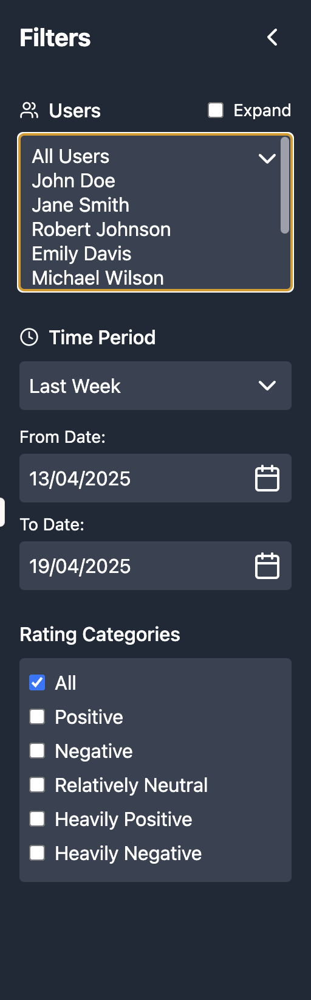

# Chatbot Dashboard Sidebar Implementation

This document provides a comprehensive overview of the sidebar implementation in the Chatbot Ratings Dashboard, detailing the libraries, components, styles, and data connections used.



## Libraries and Components

### Core Libraries
- **React**: The sidebar is built using React functional components with hooks
- **Lucide React**: Provides the icon components used throughout the sidebar
  - `ChevronLeft` and `ChevronRight`: For sidebar collapse/expand
  - `Users`: For the users section
  - `Clock`: For the time period section
  - `Calendar`: For the date selection fields
  - `ChevronDown`: For dropdown indicators

### Key Components
1. **Collapsible Container**: Responsive sidebar with toggle functionality
2. **User Selection**: Multi-select dropdown with expand/collapse functionality
3. **Time Period Selection**: Dropdown with predefined periods
4. **Date Range Selector**: Two date input fields with calendar indicators
5. **Rating Categories**: Checkbox list for filtering by rating type

## Visual Styling

### Layout and Dimensions
- **Width**: 
  - Expanded: `w-64` (16rem/256px)
  - Collapsed: `w-12` (3rem/48px)
- **Height**: `h-screen` (100% of viewport height)
- **Transition**: `transition-all duration-300` for smooth expand/collapse animation

### Color Scheme
- **Background**: `bg-gray-800` (dark gray)
- **Text**: `text-white` for all sidebar text
- **Input Backgrounds**: `bg-gray-700` for form controls (slightly lighter than the sidebar)
- **Hover States**: `hover:bg-gray-700` for interactive elements

### Typography
- **Headers**: 
  - Section headers: `font-medium` weight
  - Sidebar title: `text-xl font-bold`
- **Labels**: `text-sm` for smaller descriptive text
- **Regular text**: Default size for options and selections

### Spacing
- **Padding**:
  - Sidebar container: `p-4` (1rem/16px) on all sides
  - Sections: `mb-6` (1.5rem/24px) margin-bottom for separation
  - Input fields: `p-2` (0.5rem/8px) padding for form controls
  - Checkboxes: `mr-2` (0.5rem/8px) margin-right for spacing after checkbox
- **Corners**: `rounded` for all input elements (4px border radius)

### User Dropdown Specific Styling
- **Height**: `h-32` (8rem/128px) for expanded dropdown visibility
- **Size Attribute**: `size={6}` to show 6 options at once
- **Appearance**: `appearance-none` to remove default browser styling

## Interaction Model

### Sidebar Collapse/Expand
```jsx
const [sidebarCollapsed, setSidebarCollapsed] = useState(false);

// Toggle button
<button 
  className="p-1 rounded hover:bg-gray-700"
  onClick={() => setSidebarCollapsed(!sidebarCollapsed)}
>
  {sidebarCollapsed ? <ChevronRight /> : <ChevronLeft />}
</button>

// Conditional rendering and styling
<div className={`bg-gray-800 text-white ${sidebarCollapsed ? 'w-12' : 'w-64'} transition-all duration-300 flex flex-col`}>
  {/* Content */}
  {!sidebarCollapsed && (
    <div className="p-4 flex-1 overflow-y-auto">
      {/* Sidebar sections */}
    </div>
  )}
</div>
```

### User Selection Implementation
```jsx
const [selectedUsers, setSelectedUsers] = useState(mockUsers.map(user => user.id));
const [expandUsers, setExpandUsers] = useState(false);

// Toggle user selection
const toggleUser = (userId) => {
  if (userId === 'all') {
    if (selectedUsers.length === mockUsers.length) {
      setSelectedUsers([]);
    } else {
      setSelectedUsers(mockUsers.map(user => user.id));
    }
  } else {
    if (selectedUsers.includes(userId)) {
      setSelectedUsers(selectedUsers.filter(id => id !== userId));
    } else {
      setSelectedUsers([...selectedUsers, userId]);
    }
  }
};
```

### Time Period Selection
```jsx
const [selectedTimePeriod, setSelectedTimePeriod] = useState('last-week');
const [fromDate, setFromDate] = useState('12/04/2025');
const [toDate, setToDate] = useState('19/04/2025');

// Update date range when time period changes
useEffect(() => {
  if (selectedTimePeriod === 'custom') return;
  
  const today = new Date('2025-04-19'); // Use fixed date for demo
  const timePeriod = timePeriodOptions.find(tp => tp.id === selectedTimePeriod);
  
  if (timePeriod) {
    const fromDateObj = new Date(today);
    fromDateObj.setDate(today.getDate() - timePeriod.days + 1);
    
    setFromDate(formatDate(fromDateObj));
    setToDate(formatDate(today));
  }
}, [selectedTimePeriod]);
```

### Rating Categories Selection
```jsx
const [selectedRatingCategories, setSelectedRatingCategories] = useState(['all']);

// Toggle rating category
const toggleRatingCategory = (categoryId) => {
  if (selectedRatingCategories.includes(categoryId)) {
    setSelectedRatingCategories(selectedRatingCategories.filter(id => id !== categoryId));
  } else {
    setSelectedRatingCategories([...selectedRatingCategories, categoryId]);
  }
};
```

## Data Model

### User Data Model
```typescript
interface User {
  id: number;
  name: string;
}
```

Example:
```javascript
const mockUsers = [
  { id: 1, name: 'John Doe' },
  { id: 2, name: 'Jane Smith' },
  // ...more users
];
```

### Time Period Options Model
```typescript
interface TimePeriodOption {
  id: string;      // Identifier for the period
  name: string;    // Display name
  days: number | null;  // Number of days in the period (null for custom)
}
```

Example:
```javascript
const timePeriodOptions = [
  { id: 'last-day', name: 'Last Day', days: 1 },
  { id: 'last-week', name: 'Last Week', days: 7 },
  { id: 'last-month', name: 'Last Month', days: 30 },
  { id: 'last-quarter', name: 'Last Quarter', days: 90 },
  { id: 'custom', name: 'Custom', days: null },
];
```

### Rating Categories Model
```typescript
interface RatingCategory {
  id: string;      // Identifier for the category
  name: string;    // Display name
  range: [number, number];  // Min and max values for the rating range
}
```

Example:
```javascript
const ratingCategories = [
  { id: 'all', name: 'All', range: [-10, 10] },
  { id: 'positive', name: 'Positive', range: [1, 10] },
  { id: 'negative', name: 'Negative', range: [-10, -1] },
  { id: 'neutral', name: 'Relatively Neutral', range: [-3, 3] },
  { id: 'heavily-positive', name: 'Heavily Positive', range: [7, 10] },
  { id: 'heavily-negative', name: 'Heavily Negative', range: [-10, -7] },
];
```

### Rating Data Model
```typescript
interface Rating {
  id: number;
  userId: number;
  date: string;     // Format: 'dd/mm/yyyy'
  rating: number;   // Range: -10 to 10
  message: string;  // User feedback message
}
```

## Data Connection and Filtering

The sidebar connects to the data through a series of filtering functions that react to the selections made in the sidebar controls:

```javascript
// Filter ratings based on selection
const getFilteredRatings = () => {
  let filtered = [...mockRatings];
  
  // Filter by users
  if (selectedUsers.length > 0 && selectedUsers.length < mockUsers.length) {
    filtered = filtered.filter(rating => selectedUsers.includes(rating.userId));
  }
  
  // Filter by date
  const fromDateParts = fromDate.split('/');
  const fromDateObj = new Date(`${fromDateParts[2]}-${fromDateParts[1]}-${fromDateParts[0]}`);
  
  const toDateParts = toDate.split('/');
  const toDateObj = new Date(`${toDateParts[2]}-${toDateParts[1]}-${toDateParts[0]}`);
  toDateObj.setHours(23, 59, 59);
  
  filtered = filtered.filter(rating => {
    const dateParts = rating.date.split('/');
    const ratingDate = new Date(`${dateParts[2]}-${dateParts[1]}-${dateParts[0]}`);
    return ratingDate >= fromDateObj && ratingDate <= toDateObj;
  });
  
  // Filter by rating categories
  if (!selectedRatingCategories.includes('all')) {
    const ranges = selectedRatingCategories.map(catId => {
      const category = ratingCategories.find(cat => cat.id === catId);
      return category ? category.range : null;
    }).filter(Boolean);
    
    if (ranges.length > 0) {
      filtered = filtered.filter(rating => {
        return ranges.some(range => rating.rating >= range[0] && rating.rating <= range[1]);
      });
    }
  }
  
  return filtered;
};
```

## Key Design Decisions

1. **Dark Theme**: The dark sidebar creates visual separation from the main content area and reduces eye strain.

2. **Collapsible Design**: Allows users to maximize screen space for the dashboard when needed.

3. **Expandable User Selection**: 
   - As a dropdown by default to save space
   - Expandable to a full list for easier multiple selection

4. **Linked Time Period and Date Fields**: 
   - Predefined periods for quick selection
   - Date fields that update automatically but remain editable for custom ranges

5. **Hierarchical Organization**:
   - Users at the top (most frequent filter)
   - Time period in the middle (secondary filter)
   - Rating categories at the bottom (tertiary filter)

6. **Visual Indicators**:
   - Checkmarks in the dropdown to show selected items
   - Icons for each section for quick visual identification
   - Dropdown arrows to indicate expandable sections

## Implementation Considerations

### Accessibility
- All interactive elements are keyboard navigable
- Labels are properly associated with their inputs
- Sufficient color contrast between text and background
- Focus states are preserved for keyboard navigation

### Responsiveness
- The sidebar is fully responsive and can collapse to save space
- The expanded dropdown view is scrollable when needed
- Content adjusts dynamically based on available space

### Performance
- State updates are optimized to prevent unnecessary re-renders
- Filter functions run only when selections change

## Integration Requirements

To integrate this sidebar with a real data source, you would need:

1. **User Data API**: Endpoint to fetch users for the dropdown
2. **Ratings Data API**: Endpoint to fetch ratings with filtering parameters
3. **Date Formatting Utility**: To handle date conversions between API and display formats
4. **State Management**: For larger applications, consider moving state to Redux or Context API
5. **Form Validation**: Add validation for date inputs to ensure proper format
6. **Error Handling**: Add error states for failed API requests